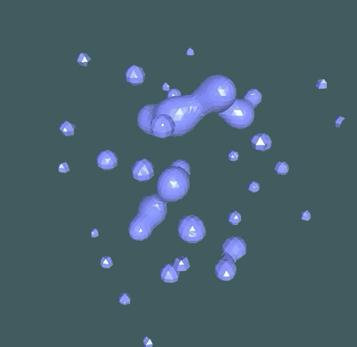

# SPH Fluid Simulation with Metaballs :ocean:
:bookmark_tabs: Final Project for DH2323 Computer Graphics and Interaction Spring 2019 in KTH.

### Screenshot

## Binary Distribution (Recommended)
Since we have some dependent files in our releases, we advise you to put both `build` and `shader` folder under the same directory. And run the application inside `build/` directory.
- [OSX Build](https://github.com/Alexander-Hjelm/metaballs-glfw/releases/tag/v1.0)
- [Linux Build](https://github.com/Alexander-Hjelm/metaballs-glfw/releases/tag/v1.0)

## Manual Compilation
Perform a `git clone`, or download as a ZIP file.

### Mac users
1. Open Xcode and create a new Xcode project (`File -> New -> Project`). 
2. Under `cross-platform` tab, choose `External Build System` template and setup the new project.
3. Go to the `info` tab inside your project targets. Change the `Directory` field to this repository directory (i.e. `metaballs-glfw`).
4. Drag all related source files into the project navigation panel.
5. Compile and link other [third-party dependencies](#third-party-dependencies) to project.
6. Build and run the application!

### Linux users
1. Make sure you have all [third-party dependencies](#third-party-dependencies) installed on your machine. If not, use `sudo apt-get install` or follow the guidelines in the original repository.
2. Open terminal and go to this repository directory (i.e. `metaballs-glfw`). 
3. Execute `make`.
4. First `cd build/`, then run the application with `./metaballs-glfw`!

## Third-Party Dependencies
* [glad](https://github.com/Dav1dde/glad) - Multi-Language Vulkan/GL/GLES/EGL/GLX/WGL Loader-Generator based on the official specs.
* [glfw](https://github.com/glfw/glfw) - A multi-platform library for OpenGL, OpenGL ES, Vulkan, window and input
* [glm](https://github.com/g-truc/glm.git) - OpenGL Mathematics
Graphical User interface for C++ with minimal dependencies
